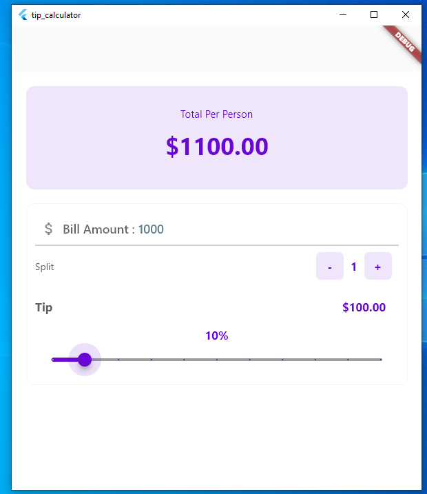

# Flutter Tip Calculator Bill Splitter Apps

## Description:
Are you tired of the hassle of splitting the bill with friends and calculating tips manually? Look no further! Introducing the Tip Splitter Calculator, your ultimate solution for hassle-free bill splitting and tip calculation. Whether you're dining out, enjoying drinks, or simply sharing expenses with friends, this Flutter app is here to make your life easier.

### Below are the step by step details on how to build this apps.
1 Step: Create a flutter new project. 
2 Step: Download repository. 
3 Step: Open Flutter-Tip-Calculator-Bill-Splitter folder. 
4 Step: Go to lib folder and open main.dart file. I have discussed everything inside code. 
5 Step: Copy lib folder and paste your project the run 
